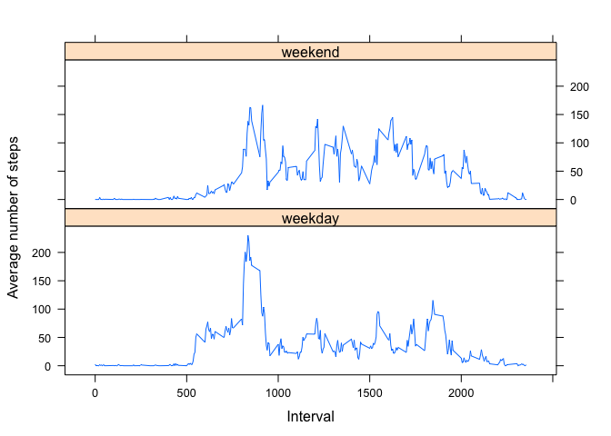

# Reproducible Research: Peer Assessment 1
Jeroen Remmerswaal  
10 Jan 2015  

This is an R Markdown document, describing the reproducible research for Peer Assessment 1 for the Reproducible Research Course for the Data Science Specialization.

The steps for the Assessment are laid out below and are making use of literate programming by embedding R code in this document.


## Loading and preprocessing the data

Here's what the file looks like:


```r
setwd("/Users/jeroen/Documents/Coursera/datascience/[5] Reproducible Research/RepData_PeerAssessment1")
unzip("activity.zip", overwrite=TRUE)
activity <- read.csv("activity.csv", )

## Present a chunk of the data
head(activity)
```

```
##   steps       date interval
## 1    NA 2012-10-01        0
## 2    NA 2012-10-01        5
## 3    NA 2012-10-01       10
## 4    NA 2012-10-01       15
## 5    NA 2012-10-01       20
## 6    NA 2012-10-01       25
```

## What is mean total number of steps taken per day?

We calculate the number of steps taken by day using the aggregate function as such:


```r
## Aggregate the data by date, and sum the number of steps.
x <- aggregate(activity$steps,by=list(activity$date), FUN=sum, na.rm=TRUE)

## Assign friendly names to the columns
colnames(x) <- c("Date", "Sum of the number of steps")
```


```r
hist(
    x$"Sum of the number of steps", 
    xlab="Sum of steps",
    ylab="Day",
    main="Total number of steps taken each day"
)
```

 

The mean and median frequencies are:


```r
mean(x$"Sum of the number of steps")
```

```
## [1] 9354
```

```r
median(x$"Sum of the number of steps")
```

```
## [1] 10395
```

## What is the average daily activity pattern?


```r
## Aggregate the data by interval, and sum the number of steps.
x <- aggregate(activity$steps, by=list(activity$interval), FUN=mean, na.rm=TRUE)

## Assign friendly names to the columns
colnames(x) <- c("Interval", "Average of the number of steps")

plot(
    x$Interval , 
    x$"Average of the number of steps", 
    xlab="Interval (00:00-23:55)", 
    ylab="Average number of steps averaged over all days", 
    main="Average daily activity", 
    type="l"
)
```

 

Which 5-minute interval, on average across all the days in the dataset, contains the maximum number of steps:


```r
max(x$"Average of the number of steps")
```

```
## [1] 206.2
```

And this particular interval was at:


```r
x[x$"Average of the number of steps" == max(x$"Average of the number of steps"),]$Interval
```

```
## [1] 835
```

## Imputing missing values

1. Calculate and report the total number of missing values in the dataset (i.e. the total number of rows with NAs):


```r
## A complete case is a row which has no NA's. 
## Note: Since the NA's only occur on the steps column we will be a bit cheeky and look at this field only. 
sum(!complete.cases(activity))
```

```
## [1] 2304
```

2. Devise a strategy for filling in all of the missing values in the dataset. The strategy does not need to be sophisticated. For example, you could use the mean/median for that day, or the mean for that 5-minute interval, etc.

3. Create a new dataset that is equal to the original dataset but with the missing data filled in.


```r
## Create a new data set averaged by date
x <- aggregate(activity$steps,by=list(activity$interval), FUN=mean, na.rm=TRUE)

## Assign friendly names to the columns
colnames(x) <- c("interval", "average")

## Merge the data sets
merged <- merge(activity, x, by="interval")

## Replace the NAs with the computed value 
merged$steps[is.na(merged$steps)] <- merged$average[is.na(merged$steps)]
```

4. Make a histogram of the total number of steps taken each day and Calculate and report the mean and median total number of steps taken per day. Do these values differ from the estimates from the first part of the assignment? What is the impact of imputing missing data on the estimates of the total daily number of steps?


```r
## Aggregate the data by date, and sum the number of steps.
x <- aggregate(merged$steps,by=list(merged$date), FUN=sum)

## Assign friendly names to the columns
colnames(x) <- c("Date", "Sum of the number of steps")
```

As one can see the histogram differs quite largely from the original one:


```r
hist(
    x$"Sum of the number of steps", 
    xlab="Sum of steps",
    ylab="Day",
    main="Total number of steps taken each day"
)
```

 

The mean and median frequencies are as follows and are different from the original values:


```r
mean(x$"Sum of the number of steps")
```

```
## [1] 10766
```

```r
median(x$"Sum of the number of steps")
```

```
## [1] 10766
```

## Are there differences in activity patterns between weekdays and weekends?

1. Create a new factor variable in the dataset with two levels ??? ???weekday??? and ???weekend??? indicating whether a given date is a weekday or weekend day.


```r
daytypes=c("weekday","weekend")

merged$daytype[!(weekdays(as.Date(merged$date)) %in% c("Saturday", "Sunday"))] = daytypes[1]
merged$daytype[weekdays(as.Date(merged$date)) %in% c("Saturday", "Sunday")] = daytypes[2]
```

2. Make a panel plot containing a time series plot (i.e. type = "l") of the 5-minute interval (x-axis) and the average number of steps taken, averaged across all weekday days or weekend days (y-axis). See the README file in the GitHub repository to see an example of what this plot should look like using simulated data.


```r
## Aggregate the data by interval, and sum the number of steps.
merged_aggregated <- aggregate(merged$steps, by=list(merged$daytype, merged$interval), FUN=mean)

## Assign friendly names to the columns
colnames(merged_aggregated) <- c("daytype", "interval", "average")

## If needed lattice package must be installed in your environment!
library(lattice)
```

```
## Warning: package 'lattice' was built under R version 3.1.2
```

```r
## And plot (if needed lattice package muse be installed in your environment)!
xyplot(average ~ interval | daytype, 
    data = merged_aggregated,
    type = "l",
    xlab = "Interval",
    ylab = "Average number of steps",
    layout=c(1,2)
)
```

 

